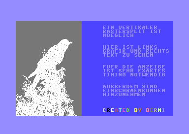

# Vertikaler Rastersplit

Dieses (statische) Demo zeigt, dass es beim C64 möglich ist, einen
vertikalen Rastersplit durchzuführen, also links Grafik und rechts
Text anzuzeigen:

Das große Problem dabei sind die sogenannten Badlines: In jeder achten
Zeile wird der Prozessor kurz abgeschaltet, damit der Grafik-Chip
zusätzliche Informationen aus dem Speicher auslesen kann. Im
Text-Modus sind das die Zeichen, die dargestellt werden sollen und im
Grafik-Modus die Farben.

Wenn der Prozessor abgeschaltet ist, also in jeder Badline, kann man
nicht zwischen Grafik und Text umschalten.

Hier wird das so gelöst: Für den Grafik-Teil werden die Badlines
(außer in der obersten Zeile) abgeschaltet. Dadurch werden die
Farbinformationen von der obersten Zeile für die kommenden Zeilen
weiter genutzt. In der Mitte der Zeile wird dann auf Textbildschirm
umgeschaltet. Zudem werden die Badlines hier wieder eingeschaltet,
damit der neue Text eingelesen werden kann. Letzten Endes hat man also
lauter halbe Badlines.

Ein weiteres Problem ist der Zeichensatz: Beim Umschalten ist nicht
genügend Zeit, den Zeichensatz ebenfalls umzuschalten. Die Grafik und
der Zeichensatz liegen deswegen an der selben Stelle im RAM. Dies
wurde hier so gelöst, dass die Zeichen sich in den ersten acht Zeilen
der Grafik befinden; diese werden gar nicht angezeigt - wenn man genau
hinguckt sieht man, dass der obere Rahmen etwas dicker ist, als der
untere.

## Hinweis

Dieses Programm funktioniert nur mit PAL-VIC. Bei einem NTSC-VIC
müssten geringfügige Änderungen am Timing vorgenommen werden.
